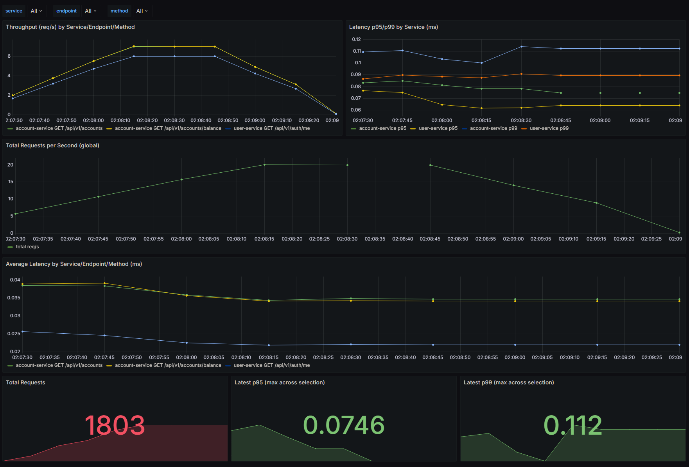
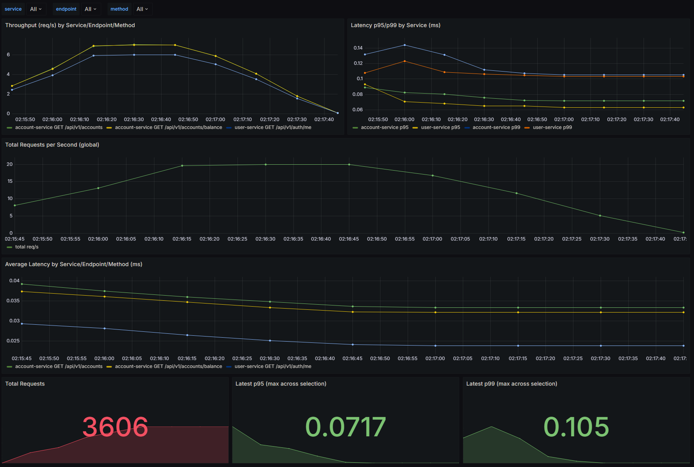
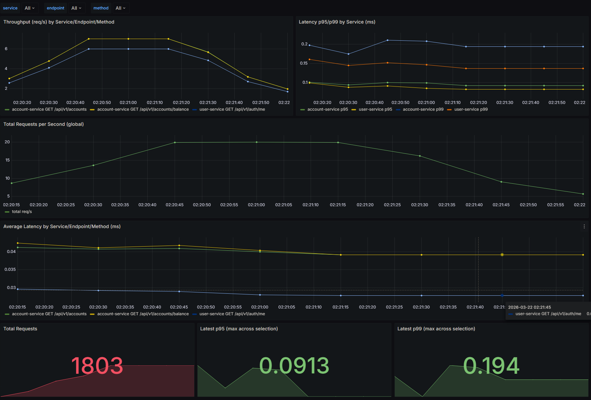
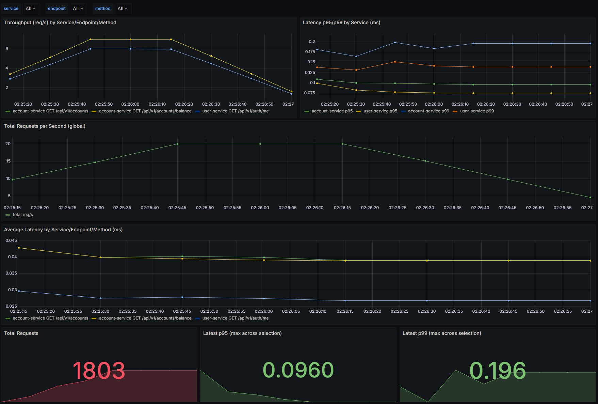
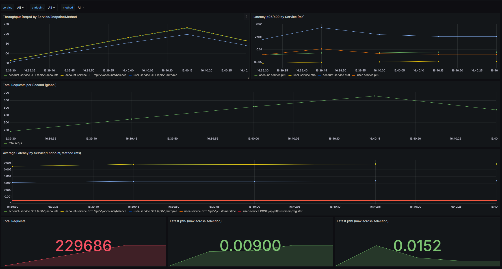
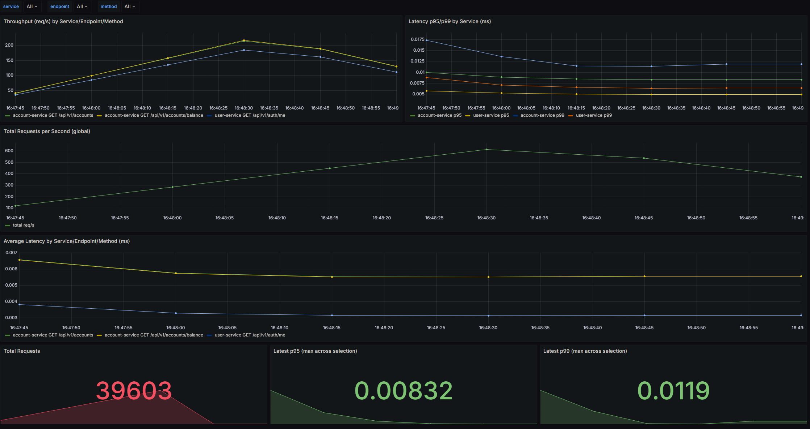
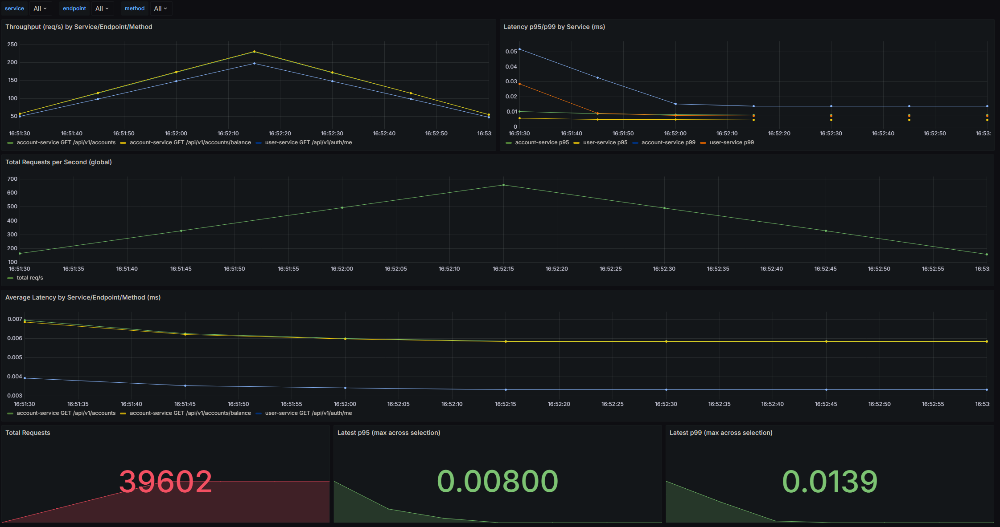
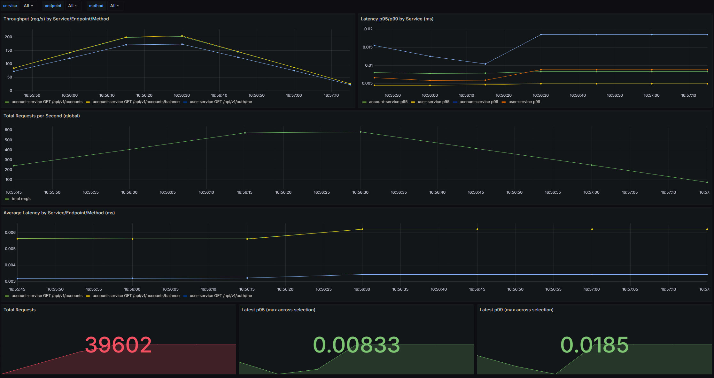

# Rapport - CanBankX (Phase 1)

## Arc42
Cette section présente la documentation d'architecture du projet CanBankX selon le modèle Arc42.

### 1. Introduction et Objectifs

CanBankX est une plateforme bancaire complète fondée sur une architecture microservices. Le système s'appuie sur un API Gateway comme point d'entrée unique, puis répartit les responsabilités entre les services `User`, `Account` et `Transfer`. Cette organisation permet d'isoler les domaines métier, de simplifier l'évolution du code et de limiter l'impact des changements sur l'ensemble de la plateforme.

L'architecture met en pratique plusieurs concepts clés des systèmes distribués. Le load balancing permet la montée en charge horizontale, avec plusieurs instances actives selon le niveau de trafic. Redis est utilisé comme cache pour réduire le temps de réponse des opérations fréquentes. L'observabilité repose sur Prometheus pour la collecte de métriques et Grafana pour la visualisation. Les campagnes de performance sont exécutées avec k6, et le suivi opérationnel s'appuie sur les 4 Golden Signals: latence, trafic, erreurs et saturation.

Le but du projet est de démontrer la conception et l'exploitation d'un système distribué capable de gérer des opérations bancaires réelles, notamment la gestion des utilisateurs, des comptes et des virements. Le choix architectural vise à fournir une plateforme scalable, fiable et observable, tout en conservant une base technique maintenable pour l'équipe de développement.

Les objectifs de qualité couvrent la performance, la scalabilité, la fiabilité, la maintenabilité et l'observabilité. Les cibles non fonctionnelles principales sont une latence `P95 <= 500 ms`, un débit `>= 600 opérations par seconde` et une disponibilité `>= 95 %`. Pour une plateforme bancaire, ces objectifs sont essentiels: des réponses rapides améliorent l'expérience utilisateur, un bon débit garantit la continuité de service sous charge, et la disponibilité protège la confiance des utilisateurs.

Les parties prenantes de CanBankX incluent d'abord les développeuses et développeurs, qui conçoivent, testent et maintiennent les services. Les responsables techniques exploitent l'infrastructure, surveillent les indicateurs et gèrent la stabilité globale du système. Enfin, les utilisatrices et utilisateurs interagissent avec la plateforme pour consulter leurs comptes et effectuer des transactions de manière fiable.

### 2. Contraintes d'architecture

| Contrainte | Description |
|---|---|
| Technique | Services en Rust, gateway KrakenD, Redis, PostgreSQL, Docker |
| Déploiement | Déploiement en conteneurs Docker via `docker-compose`, avec communication inter-services sur un réseau Docker partagé |
| Réseau | Point d'entrée public via load balancer NGINX |
| API Gateway | KrakenD comme point d'entrée unique pour tous les appels API, avec contrôle du rate limiting et des timeouts |
| Sécurité | Authentification par jeton JWT (via Keycloak) sur routes protégées |
| Conception API | Les endpoints doivent suivre les principes RESTful |
| Organisation des données | Séparation par contexte métier (User, Account, Transfer) |
| Observabilité | Prometheus et Grafana pour le monitoring, avec k6 pour les tests de performance |
| Scalabilité | Le système doit fonctionner avec 1 à 4 instances |

### 3. Portée et contexte du système

CanBankX couvre les opérations bancaires principales d'un client: authentification, consultation des comptes, consultation de l'historique des transactions et exécution de virements. Les acteurs principaux sont l'utilisateur de la plateforme, les services métier (`User`, `Account`, `Transfer`) et les systèmes externes de support comme le fournisseur d'identité pour l'authentification.

La frontière du système commence au point d'entrée API (load balancer + gateway) et inclut l'ensemble des microservices bancaires. Les interactions externes passent par des appels API sécurisés, puis sont routées vers le service métier concerné. Le système retourne ensuite un résultat fonctionnel à l'utilisateur, soit une réponse de consultation, soit une confirmation ou un refus de transfert.

<p align="center">
    
</p>


Ce diagramme présente le parcours utilisateur de haut niveau dans CanBankX: l'utilisateur choisit `Sign-Up` ou `Sign-In`, passe par l'OTP, puis accède aux opérations si l'authentification et le KYC sont valides. Depuis la page principale, il peut consulter ses comptes, créer un compte avec un solde initial, ou effectuer un transfert (compte source, destinataire, montant) avec confirmation ou refus, puis revenir au menu jusqu'au logout.

### 4. Stratégie de solution

| Problème | Stratégie |
|---|---|
| Standardisation API | Principes REST avec méthodes HTTP cohérentes et nommage clair des ressources |
| Point d'entrée unique | API Gateway KrakenD devant tous les microservices |
| Protection des services | Rate limiting, timeouts et contrôle d'accès via la gateway |
| Sécurité d'accès | Authentification centralisée avec Keycloak, MFA/OTP et contrôles KYC |
| Distribution de charge | NGINX avec plusieurs instances de gateway |
| Séparation des responsabilités | Bounded Contexts `User`, `Account`, `Transfer` et logique métier isolée par service |
| Cohérence transactionnelle | Vérifications métier sur les transferts (compte source, bénéficiaire, solde, validation) |
| Performance en lecture | Cache Redis pour les données fréquemment consultées |
| Observabilité opérationnelle | Prometheus pour les métriques, Grafana pour les tableaux de bord, suivi des Golden Signals |
| Validation de performance | Tests de charge avec k6 pour mesurer latence, débit et stabilité |
| Exploitation | Déploiement en conteneurs Docker via `docker-compose` pour un environnement reproductible |
| Scalabilité | Architecture microservices permettant la montée en charge horizontale (1 à 4 instances) |

La solution privilégie une architecture simple à exploiter et facile à faire évoluer service par service.

### 5. Vue des blocs de construction

CanBankX est structuré en trois services métier Rust (`user-service`, `account-service`, `transfer-service`) derrière KrakenD. Chaque service expose ses routes HTTP via des contrôleurs, applique la logique métier dans une couche service, puis accède à PostgreSQL via des repositories SQLx. Les services `account` et `transfer` utilisent aussi Redis pour le cache (solde, listes, détails), tandis que `transfer-service` appelle `user-service` et `account-service` pour résoudre le bénéficiaire et appliquer le transfert. La supervision repose sur Prometheus (collecte) et Grafana (visualisation).

Composants clés :
- Contrôleurs API : gèrent les requêtes et les réponses HTTP dans chaque service.
- Couche logique métier : applique les règles fonctionnelles (KYC, comptes, transferts).
- Modèles Rust + repositories SQLx : assurent l'abstraction de l'accès à PostgreSQL.
- Cache Redis : met en cache les soldes, listes de comptes et détails de transferts.
- API Gateway KrakenD : centralise le routage, la validation JWT et les règles de sécurité.
- Keycloak : gère l'identité, l'authentification et les flux OIDC.
- Audit repositories : enregistrent les événements d'audit dans chaque service métier.
- Observabilité : métriques Prometheus, tableaux de bord Grafana et tests de charge k6.


<p align="center">
    
</p>

Ce diagramme montre les blocs de construction réels du code: routes, services, repositories, cache Redis, bases PostgreSQL par domaine, et dépendances inter-services pour le parcours de transfert.

<p align="center">
    
</p>

Ce diagramme de classe expose les structs et implémentations Rust de chaque service. Pour chaque domaine (`User`, `Account`, `Transfer`), les contrôleurs reçoivent l'état, invoquent les services métier, qui eux-mêmes utilisent les repositories pour persister les données et le cache Redis pour optimiser les lectures. Les dependencies inter-services (Transfer→User, Transfer→Account) sont montrées en pointillé pour signaler une communication HTTP entre services.

<p align="center">
    
</p>

Ce diagramme d'états représente le cycle KYC fonctionnel exposé par l'API du `user-service`. Après `submit_kyc`, le dossier reste en `PENDING` pendant 15 secondes (`decision_delay_seconds`). Une fois ce délai passé, la décision est calculée avec les données mock: si `full_name` et `nas` correspondent à une identité du fichier mock, le résultat est `APPROVED`; sinon, le résultat est `REJECTED`. Une nouvelle soumission permet de relancer le cycle.


### 6. Vue d'exécution

Pour cette vue d'exécution, nous présentons un seul scénario représentatif afin de montrer la séquence générale du système, parce que les autres parcours suivent globalement la même structure d'appels.

### Scénario : création d'un compte chèque

Ce scénario décrit le flux réel de `POST /api/v1/accounts/create` pour créer un compte de type `CHEQUING`. La requête passe par NGINX puis KrakenD (validation JWT), avant d'être traitée dans `account-service` (contrôleur, validation métier, persistance, cache et audit).

<p align="center">
    
</p>

Cette séquence montre les étapes clés de création: validation du payload, création en base (`accounts` + `account_balances`), mise à jour du cache Redis, journalisation d'audit et retour HTTP `201 Created`. Redis est utilisé ici après l'écriture pour préparer les lectures suivantes, et non comme source principale pendant la création.

Le flux applique aussi des règles métier importantes. Le `customer_id` doit être un UUID valide, le `account_type` doit être autorisé (`CHEQUING` ou `SAVINGS`) et le `initial_balance` doit être un nombre fini non négatif. Dans la persistance, le service vérifie d'abord si le client possède déjà des comptes pour déterminer `is_default`: le premier compte du client devient le compte par défaut. Ce champ est utilisé pour les transferts: c'est ce compte qui peut recevoir les transferts provenant d'autres personnes.

Sur le plan technique, KrakenD protège l'entrée avec la validation JWT avant de transférer la requête au service `account`. Le `trace_id` est propagé jusqu'à la couche d'audit pour faciliter le suivi. Si la validation échoue, le service retourne une erreur `400 Bad Request`; sinon la création se termine avec une réponse `201 Created` contenant l'identifiant du nouveau compte et son état initial.

### 7. Vue de déploiement

<p align="center">
    
</p>


Ce diagramme montre un déploiement Docker Compose sur un réseau partagé `can-bank-x-network`. Le client entre par `edge-load-balancer`, puis les requêtes sont distribuées vers les instances `api-gateway`. La gateway route ensuite vers les services métier et vers Keycloak pour la validation JWT. Les données métier sont stockées dans PostgreSQL, tandis que Redis est utilisé pour le cache des services `account` et `transfer`. La supervision est assurée par Prometheus et visualisée dans Grafana.

**Architecture conteneurs :**
- `edge-load-balancer` (NGINX) est le point d'entrée public sur le port `8080`.
- `api-gateway` (KrakenD) est déployé en `1..4` instances pour le routage et la sécurité.
- `user-service`, `account-service` et `transfer-service` (Rust/Axum) exposent leurs API sur `:8080` dans le réseau interne.
- `postgres` héberge trois bases (`canbankx_user`, `canbankx_account`, `canbankx_transfer`) et `redis` fournit le cache.
- `prometheus`, `grafana`, `postgres-exporter`, `node-exporter` et `cadvisor` forment la pile d'observabilité.

### 8. Concepts transversaux

### Bounded Contexts

- `User`: identité client, profil, informations utilisateur.
- `Account`: gestion des comptes et soldes.
- `Transfer`: création et suivi des virements.

### Concepts techniques communs

- `Principes REST`: architecture client-serveur, communication sans état, interface uniforme et système en couches.
- `API Gateway Pattern`: point d'entrée unique avec KrakenD pour le routage, la sécurité et les politiques transversales.
- `Microservices Pattern`: séparation des responsabilités par domaine métier (`User`, `Account`, `Transfer`).
- `Communication conteneurs`: réseau Docker partagé pour la découverte de services et les appels inter-conteneurs.
- `Stratégie de cache`: Redis pour optimiser les lectures fréquentes (soldes, listes de comptes, détails de transfert).
- `Rate Limiting`: protection contre les abus et la surcharge au niveau gateway.
- `Circuit Breaker / Timeout control`: limitation des temps d'attente pour éviter le blocage en cascade.
- `Observabilité`: logs structurés, métriques Prometheus et tableaux de bord Grafana.

### Normalisation des erreurs API

La normalisation des erreurs API est importante dans une architecture microservices. Elle garantit des réponses cohérentes entre services, facilite le débogage et rend le comportement plus prévisible pour les clients (frontend, tests, scripts d'intégration). Elle améliore aussi l'observabilité, car les erreurs deviennent plus simples à filtrer et à corréler.

Le système utilise un format d'erreur standardisé, par exemple:

```json
{
    "error": "INVALID_REQUEST",
    "message": "Initial balance must be greater than or equal to 0",
    "status": 400,
    "trace_id": "abc123"
}
```

Signification des champs:
- `error`: code d'erreur fonctionnel ou technique, stable pour le client.
- `message`: description lisible de l'erreur.
- `status`: code HTTP associé (ex: `400`, `404`, `500`).
- `trace_id`: identifiant de traçage pour relier la requête aux logs et aux métriques.

Cette normalisation est appliquée à deux niveaux:
- API Gateway: gestion de certaines erreurs HTTP transversales (authentification, routage, politiques gateway).
- Microservices: validation métier et erreurs applicatives dans les contrôleurs/services, avec un format uniforme avant retour au client.

Cette approche améliore la maintenabilité, accélère le diagnostic, facilite le monitoring des erreurs et simplifie l'intégration côté client.

### Golden Signals

- Latence: p95, p99 sur les requêtes API.
- Trafic: requêtes par seconde et volume total.
- Erreurs: taux de codes 4xx/5xx et erreurs métier.
- Saturation: CPU, mémoire, connexions DB, pression sur cache.


### 9. Décisions d'architecture (ADR)

#### ADR 1 — Utilisation de Rust pour les microservices

**Contexte technique**  
CanBankX doit offrir une bonne performance sous charge et rester fiable pour des opérations bancaires. Les services backend manipulent des traitements concurrents, des accès base de données fréquents et des validations métier sensibles (comptes, soldes, transferts).

**Décision adoptée**  
Les microservices `user-service`, `account-service` et `transfer-service` sont implémentés en Rust, avec `Axum` pour l'API HTTP, `Tokio` pour l'exécution asynchrone et `SQLx` pour PostgreSQL. Ce choix est appliqué de manière homogène sur les trois domaines métier afin de conserver une base technique cohérente.

**Justification et avantages**  
Rust fournit de bonnes performances, une sécurité mémoire forte (sans garbage collector) et une concurrence efficace. Cette combinaison améliore la stabilité du backend, réduit une classe d'erreurs critiques en production et convient bien à des services API à fort trafic.

**Conséquences et compromis**  
Le principal compromis est la courbe d'apprentissage, plus exigeante que d'autres stacks. Le temps de développement initial peut être plus long, surtout pour une équipe moins familière avec Rust, et certains cycles de compilation peuvent ralentir l'itération locale.

#### ADR 2 — Utilisation de KrakenD comme API Gateway

**Contexte technique**  
Le système expose plusieurs microservices et ne doit pas imposer au client de gérer plusieurs points d'accès. Il fallait centraliser le routage, la validation de sécurité et les règles transversales (CORS, rate limiting, timeouts), tout en gardant les services métiers concentrés sur leur logique fonctionnelle.

**Décision adoptée**  
KrakenD est utilisé comme API Gateway unique devant les services métier. Il route les requêtes vers `user-service`, `account-service` et `transfer-service`, applique les contrôles JWT via la configuration gateway et propage des informations d'identité utiles aux services en aval.

**Justification et avantages**  
Cette décision simplifie la communication côté client, réduit le couplage client-service et isole les préoccupations transversales hors des services métier. Elle améliore la modularité, facilite l'évolution des endpoints et rend l'architecture plus lisible.

**Conséquences et compromis**  
La gateway devient un point critique à superviser. Une mauvaise configuration peut affecter plusieurs services, ce qui impose des tests de configuration, des vérifications de sécurité et une surveillance continue des métriques gateway.

#### ADR 3 — Utilisation de Keycloak pour l'authentification et la gestion des identités

**Contexte technique**  
CanBankX nécessite un mécanisme d'authentification robuste, une gestion centralisée des comptes et des politiques de sécurité cohérentes entre tous les services. Le projet devait aussi supporter un parcours d'authentification avec OTP/MFA, sans réimplémenter cette logique dans chaque microservice.

**Décision adoptée**  
Keycloak est utilisé comme fournisseur d'identité. Il gère les utilisateurs, l'émission des jetons OIDC/JWT, les pages de login/inscription et les actions de sécurité comme l'OTP. KrakenD valide ensuite les jetons via les clés publiques du realm et applique la protection des routes API.

**Justification et avantages**  
La centralisation de l'identité réduit la duplication de logique de sécurité dans les microservices et normalise la gestion des accès. Le modèle OIDC/JWT facilite l'intégration avec la gateway, renforce la cohérence des politiques d'accès et améliore la traçabilité des appels authentifiés. Keycloak permet aussi d'activer le MFA via OTP, avec des applications déjà utilisées comme Microsoft Authenticator.

**Conséquences et compromis**  
Cela ajoute un composant d'infrastructure supplémentaire à exploiter. L'équipe doit maintenir la configuration du realm, les flux d'authentification, les thèmes et la disponibilité de Keycloak, avec une attention particulière lors des changements de configuration sécurité. Son implémentation et sa configuration sont relativement difficiles au début (realm, clients, rôles, flux), ce qui demande du temps de mise en place et de validation.

### 10. Exigences qualité

Cette section définit les attributs de qualité visés par CanBankX et les mécanismes utilisés pour les atteindre.

| Exigence | Cible | Moyen de vérification |
|---|---|---|
| Latence | `P95 <= 500 ms` | Dashboards Grafana et métriques Prometheus |
| Débit | `>= 600 opérations/s` | Tests `k6` et courbes de throughput |
| Disponibilité | `>= 95 %` | Métrique `up` et suivi de santé des services |
| Scalabilité | `1` à `4` instances | Campagnes de test par niveau de scale |
| Observabilité | Golden Signals visibles | Dashboards dédiés + métriques centralisées |

**Extensibilité**
- Ajout de nouveaux endpoints REST dans chaque service en suivant la structure `routes -> controllers -> services -> repositories`.
- Séparation en bounded contexts (`User`, `Account`, `Transfer`) qui limite l'impact des changements inter-domaines.
- API Gateway configurable (KrakenD) permettant d'exposer de nouvelles routes sans modifier les clients.

**Flexibilité**
- Architecture microservices qui permet d'ajuster un service sans redéployer toute la plateforme.
- Configuration centralisée par variables d'environnement (DB, Redis, cache TTL, sécurité).
- Déploiement conteneurisé (`docker-compose`) pour reproduire facilement différents environnements.

**Performance**
- Cache Redis pour réduire la charge de PostgreSQL sur les lectures fréquentes (soldes, listes, détails).
- Services Rust asynchrones (Tokio/Axum) adaptés à une forte concurrence.
- Tests de charge k6 pour valider la latence, le débit et la stabilité sous trafic soutenu.

**Maintenabilité**
- Couches techniques claires et cohérentes dans les services (contrôleurs, logique métier, accès données).
- Conventions communes entre services (API versionnée, structure de projet, métriques).
- ADR et documentation Arc42 pour justifier les choix techniques et faciliter l'évolution.

**Fiabilité**
- Validation JWT et politiques de sécurité centralisées via KrakenD + Keycloak.
- Rate limiting et timeouts pour réduire les blocages et les surcharges.
- Health checks Docker sur les composants critiques (gateway, services, base, cache).

**Scalabilité**
- Montée en charge horizontale des instances `api-gateway` (`1` à `4` instances validées par tests).
- Répartition du trafic via NGINX en frontal.
- Isolation des rôles (gateway, services métier, cache, base, observabilité) facilitant l'extension progressive.

**Tolérance aux pannes**
- Isolation des défaillances grâce à la séparation en microservices.
- Dégradation partielle possible: un incident local n'entraîne pas automatiquement l'arrêt total du système.
- Supervision continue (Prometheus/Grafana) pour détecter rapidement les erreurs et déclencher des actions correctives.

Ces exigences sont orientées vers une architecture microservices robuste, observable et évolutive pour un contexte bancaire universitaire.

### 11. Risques et dettes techniques

| Risque / Dette | Impact | Mitigation |
|---|---|---|
| Goulot d'étranglement DB | Hausse de latence sous forte charge | Indexation SQL, tuning pool connexions, cache ciblé |
| Cohérence cache | Données possiblement périmées | Politique TTL claire et invalidation sur écriture |
| Point sensible gateway | Dégradation globale si mauvaise configuration | Scale horizontal, health checks, supervision active |
| Complexité opérationnelle microservices | Diagnostic plus difficile | Standardiser logs, traces, tableaux de bord |
| Couplage implicite entre services | Effet domino en cas de changement d'API | Contrats d'API versionnés et tests d'intégration |
| Disponibilité < objectif | Non respect du seuil de 95 % | Alertes proactives et plan de reprise |

### 12. Glossaire

| Terme | Définition |
|---|---|
| API Gateway | Point d'entrée unique qui route les requêtes vers les services |
| Bounded Context | Frontière métier claire qui définit un modèle et un vocabulaire propres |
| User Context | Contexte métier pour l'identité et le profil client |
| Account Context | Contexte métier pour les comptes et les soldes |
| Transfer Context | Contexte métier pour les virements et transactions |
| Latence P95 | Valeur de latence sous laquelle 95 % des requêtes se terminent |
| Débit | Nombre d'opérations traitées par seconde |
| Disponibilité | Pourcentage de temps où le service est accessible |
| Golden Signals | Latence, trafic, erreurs, saturation |
| Redis | Base en mémoire utilisée comme cache |
| Prometheus | Système de collecte de métriques temporelles |
| Grafana | Outil de visualisation de métriques via dashboards |
| Scalabilité horizontale | Ajout d'instances pour augmenter la capacité |

## Tests de performance

Cette section présente les expériences de performance exécutées sur CanBankX et leur analyse à partir des captures Grafana enregistrées dans le dossier `images`.

### Méthodologie des tests

Les tests de charge ont été exécutés avec `k6`. Les métriques ont été collectées par `Prometheus` puis visualisées dans `Grafana`.

La campagne a été réalisée en trois familles:
- scénario de référence sans cache Redis;
- scénario avec cache Redis activé sur les lectures concernées;
- scénario avec montée en charge horizontale du gateway (`1` à `4` instances) via le load balancer NGINX.

Les campagnes de charge ont été configurées pour viser un niveau élevé de trafic, avec une cible principale autour de `660` requêtes par seconde pour les scénarios métiers, et un objectif minimal de `600` requêtes par seconde.

Les indicateurs observés dans les tableaux de bord sont:
- latence `P95` et `P99`;
- requêtes par seconde (throughput);
- taux d'erreurs;
- saturation CPU/mémoire quand elle est visible.

### Résultats sans cache

Les captures suivantes correspondent au baseline sans cache. Elles servent de point de comparaison pour mesurer l'effet de Redis.






Sur ces vues sans cache, on observe le comportement de référence: la latence et le débit restent dépendants de la pression directe sur PostgreSQL. Les graphiques de requêtes et de latence montrent la réponse du système sans optimisation de lecture, ce qui constitue la base de comparaison pour les sections suivantes.

En termes de débit, les courbes montrent que le système atteint un palier de plusieurs centaines de requêtes par seconde, avec une référence autour du seuil cible (`600+` req/s) selon la charge appliquée.

### Résultats avec Redis

Les captures suivantes montrent la configuration avec cache Redis activé.






Par comparaison avec les captures sans cache, ces vues montrent une réduction de la pression sur la base pour les lectures répétitives. L'effet attendu est visible sur la stabilité des courbes de latence et sur la capacité à soutenir plus de requêtes, avec un taux d'erreurs maîtrisé selon les dashboards.

Le throughput observé devient plus stable autour des paliers élevés de charge, ce qui confirme que l'activation de Redis aide à maintenir les requêtes par seconde atteintes pendant les tests.

### Résultats avec load balancing

Les tests de scalabilité ont été exécutés avec `1`, `2`, `3` et `4` instances, en distribution de trafic via NGINX vers `api-gateway`.

Pour l'analyse, la comparaison des captures sans cache et avec cache permet aussi d'observer l'impact de la montée en charge:
- les premières vues représentent le comportement avec un niveau d'instances minimal;
- les vues suivantes montrent l'évolution quand la capacité horizontale augmente.

Les graphiques indiquent que la répartition de charge améliore la tenue du système sous trafic plus élevé. Quand le nombre d'instances augmente, la capacité globale progresse et les métriques de latence restent plus stables, en particulier avec Redis activé.

Dans ce contexte, l'architecture atteint et soutient les objectifs de débit visés (au moins `600` req/s, avec des campagnes ciblées à `660` req/s) de manière plus robuste lorsque plusieurs instances sont actives.

### Analyse globale

L'ensemble des captures Grafana met en évidence trois points:
- Redis améliore les performances en lecture et réduit la charge directe sur PostgreSQL.
- Le load balancing avec plusieurs instances augmente la capacité du système à absorber le trafic.
- L'architecture microservices de CanBankX supporte bien la scalabilité horizontale, avec une meilleure stabilité des indicateurs quand le cache et la distribution de charge sont combinés.

### Conclusion des tests

Les tests confirment que l'architecture choisie est cohérente avec les objectifs de performance du projet.
- Le scénario sans cache fournit un baseline utile pour la comparaison.
- L'activation de Redis améliore les lectures et la stabilité des temps de réponse.
- La montée en charge de `1` à `4` instances via load balancing améliore le throughput et la robustesse opérationnelle.

En résumé, les résultats observés dans Grafana montrent que CanBankX peut maintenir un comportement stable sous charge, tout en bénéficiant clairement du cache Redis et de la scalabilité horizontale.

## Éléments techniques supplémentaires

### Audit (append-only)

CanBankX applique un mécanisme d'audit **append-only** pour tracer les actions importantes. Dans un système bancaire, ces traces sont essentielles pour l'investigation, la conformité et l'analyse d'incidents.

Le principe est simple: les événements d'audit sont ajoutés, mais ne sont jamais modifiés ni supprimés. Cette règle est appliquée en base via des triggers `prevent_audit_log_mutation()` sur la table `audit_log`, présents dans les migrations des services `user`, `account` et `transfer`.

Exemples d'événements enregistrés:
- création de compte;
- consultation de comptes ou de soldes;
- exécution d'un transfert;
- actions système liées à la sécurité.

Les repositories d'audit (`audit_repository`) écrivent ces événements, ce qui améliore la traçabilité et l'intégrité des données opérationnelles.

### Seed de données

Le projet contient des scripts de seed pour initialiser l'environnement de données au démarrage. Le script `infra/postgres/seed-migrations.sh` applique les migrations sur les trois bases (`canbankx_user`, `canbankx_account`, `canbankx_transfer`).

Ce mécanisme est utile pour:
- démarrer rapidement un environnement local cohérent;
- éviter une base vide au lancement;
- préparer un contexte stable pour les tests d'intégration et les tests E2E.

En pratique, le seed prépare la structure et permet ensuite d'injecter facilement des jeux de données de test (utilisateurs, comptes, transactions) selon le scénario exécuté.

### Architecture de la base de données

La base suit la séparation par bounded context: chaque service possède ses tables métier, avec une table `audit_log` dédiée au contexte.

Exemples illustratifs de structure:

Table `customers`

| id | keycloak_sub | username | email | status |
|---|---|---|---|---|
| `c7d...` | `6ab...` | `test` | `test@canbankx.ca` | `ACTIVE` |

Table `accounts`

| id | customer_id | type | status | is_default |
|---|---|---|---|---|
| `a12...` | `c7d...` | `CHEQUING` | `OPEN` | `true` |

Table `account_balances`

| account_id | available | ledger |
|---|---|---|
| `a12...` | `1250.00` | `1250.00` |

Table `transfers`

| id | customer_id | from_account_id | to_account_id | amount | status |
|---|---|---|---|---|---|
| `t55...` | `c7d...` | `a12...` | `a99...` | `100.00` | `COMPLETED` |

Table `audit_log`

| id | timestamp | actor_type | action | entity_type | entity_id |
|---|---|---|---|---|---|
| `e88...` | `2026-03-08 10:12:00` | `SYSTEM` | `ACCOUNT_CREATED` | `ACCOUNT` | `a12...` |

Ces lignes sont des exemples pédagogiques pour illustrer la forme des données après un `SELECT * FROM ...`.

### Tests

La stratégie de test combine plusieurs niveaux pour sécuriser la qualité logicielle.

**Tests unitaires**
- valident des fonctions/modules isolés;
- vérifient les règles métier et validations de données.

**Tests d'intégration**
- vérifient l'interaction entre couches (API, service, repository);
- testent les échanges avec PostgreSQL et Redis.

**Tests end-to-end (E2E)**
- simulent des parcours complets via API;
- valident le comportement global du système en conditions proches du réel.

La combinaison de ces niveaux réduit les régressions et améliore la fiabilité avant livraison.

### Intégration continue (CI)

Le dépôt utilise une pipeline CI (`.github/workflows/ci.yml`) pour automatiser les vérifications.

La pipeline exécute notamment:
- vérifications de format et lint (`cargo fmt`, `cargo clippy`);
- builds et tests automatiques des services Rust;
- build des images Docker principales.

Cette automatisation détecte tôt les erreurs et protège la qualité du code avant fusion.

### Documentation API

Le projet inclut une documentation API de base pour faciliter l'utilisation des endpoints:
- spécifications OpenAPI (`docs/openapi-user-service.yaml`, `docs/openapi-account-service.yaml`, `docs/openapi-transfer-service.yaml`);
- collection Postman (`docs/collections/can-bank-x.postman_collection.json`) et environnement associé.

Ces artefacts aident les développeurs à explorer les routes, tester des appels et comprendre les formats de requêtes/réponses.


